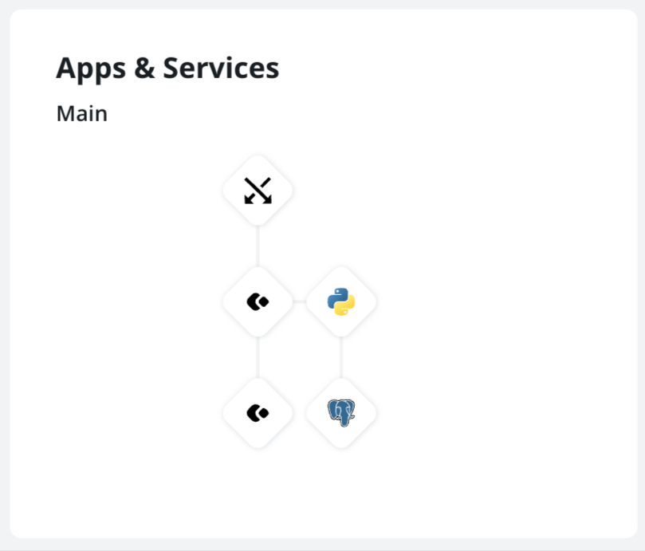

# LibreChat on Upsun

Deploy [LibreChat](https://www.librechat.ai/) on [Upsun](https://upsun.com/) with full RAG (Retrieval-Augmented Generation) support for document search via Agents.

## Architecture



| Component | Type | Role |
|-----------|------|------|
| `librechat` | `nodejs:20` | LibreChat web app (v0.8.5, cloned and built at deploy time) |
| `rag-api` | `python:3.12` | [rag_api](https://github.com/danny-avila/rag_api) v0.5.0 — embedding + vector search |
| `database` | `mongodb-enterprise:7.0` | LibreChat data (users, conversations, files) |
| `pgdb` | `postgresql:16` + pgvector | Vector store for document embeddings |

The `rag-api` app is wired to `librechat` via an app-to-app relationship. LibreChat Agents use it for file search (upload a PDF, ask questions about it).

## Prerequisites

- An [Upsun](https://upsun.com/) account
- The [Upsun CLI](https://docs.upsun.com/administration/cli.html) installed and authenticated

## Deploy

### 1. Create a new project

```bash
upsun project:create
```

Or link to an existing project:

```bash
upsun project:set-remote <project-id>
```

### 2. Push the code

```bash
git remote add upsun $(upsun git-remote)
git push upsun main
```

### 3. Set required secrets

These must be set before the app will start. Generate them with `openssl rand`:

```bash
upsun variable:create --sensitive=true --name=env:CREDS_KEY \
  --value=$(openssl rand -hex 32)

upsun variable:create --sensitive=true --name=env:CREDS_IV \
  --value=$(openssl rand -hex 16)

upsun variable:create --sensitive=true --name=env:JWT_SECRET \
  --value=$(openssl rand -hex 32)

upsun variable:create --sensitive=true --name=env:JWT_REFRESH_SECRET \
  --value=$(openssl rand -hex 32)
```

> `JWT_SECRET` is shared between the `librechat` and `rag-api` apps — set it at project level (not environment level) so both containers receive it.

### 4. Set your AI provider key

Add the API key for whichever model provider(s) you want to use. For Anthropic (Claude):

```bash
upsun variable:create --sensitive=true --name=env:ANTHROPIC_API_KEY \
  --value=sk-ant-...
```

Other supported providers (OpenAI, Google, etc.) follow the same pattern with their respective env var names.

### 5. Redeploy

Variables take effect on the next deploy:

```bash
upsun redeploy
```

## Configuration

### Environment variables

Non-sensitive variables are declared in `.upsun/config.yaml` under `variables.env` for each app. Key ones:

| Variable | App | Default | Description |
|----------|-----|---------|-------------|
| `ALLOW_REGISTRATION` | librechat | `true` | Set to `false` to lock signups after creating your account |
| `ALLOW_SOCIAL_LOGIN` | librechat | `false` | Enable OAuth providers |
| `EMBEDDINGS_PROVIDER` | rag-api | `huggingface` | `huggingface` (local, no key needed) or `openai` |
| `NODE_ENV` | librechat | `production` | — |

### LibreChat configuration

The `librechat.yaml` file at the project root is mounted at `/app/librechat.yaml` and loaded via `CONFIG_PATH`. Extend it to configure endpoints, model lists, or interface options. See the [LibreChat docs](https://www.librechat.ai/docs/configuration/librechat_yaml) for the full reference.

## RAG / Document Search

Document search works through LibreChat **Agents**:

1. In LibreChat, go to **Agents** and create a new agent.
2. Enable the **File Search** tool on the agent.
3. Start a conversation with that agent and upload a PDF or text file.
4. Ask questions — the agent will retrieve relevant passages from the document.

The `rag-api` handles embedding and retrieval. Uploaded files are stored in the `rag-api` mount (`/app/uploads`) and embeddings are stored in PostgreSQL via pgvector.

### Switching the embeddings provider

The default is HuggingFace (local, no API key required, but slower on first use while the model downloads):

```bash
# Switch to OpenAI embeddings (faster, requires an API key)
upsun variable:set env:EMBEDDINGS_PROVIDER openai
upsun variable:create --sensitive=true --name=env:OPENAI_API_KEY --value=sk-...
upsun redeploy
```

To switch back:

```bash
upsun variable:set env:EMBEDDINGS_PROVIDER huggingface
upsun redeploy
```

> Changing the provider invalidates existing embeddings. Re-upload your documents after switching.

## Persistent storage

| Mount | App | Purpose |
|-------|-----|---------|
| `/app/librechat` | librechat | Logs |
| `/app/.librechat/uploads` | librechat | User file uploads (path hardcoded in LibreChat) |
| `/app/.librechat/client/public/images` | librechat | Generated images (path hardcoded in LibreChat) |
| `/app/uploads` | rag-api | Raw uploaded files |
| `/app/hf-cache` | rag-api | HuggingFace model cache (persists across deploys) |

## Notes

- **Build time**: The `librechat` build hook clones LibreChat v0.8.5 and runs `npm run frontend` (installs ~1800 packages, compiles all workspace packages and the Vite frontend). Expect 3–5 minutes on first deploy; Upsun caches the build artifact so subsequent deploys with no code changes are instant.
- **Node.js version**: LibreChat must run on Node.js 20. On Node.js 22 the `module-alias` package fails to resolve workspace-local `node_modules` due to CJS loader changes introduced in that version.
- **MongoDB**: The managed `mongodb-enterprise:7.0` service is required. Running MongoDB from a Node.js or Nix package is not currently viable on Upsun:
  - **MongoDB 7.x** (Nix): not in the Nix binary cache — source compilation fails due to a store path remapping issue in the Upsun build environment (`impure path` linker error).
  - **MongoDB 8** (Nix): in the binary cache and installs fine, but fails to start at runtime due to a [`numpossiblecpusnocache` CPU topology check](https://www.mongodb.com/community/forums/t/disable-numpossiblecpusnocache-check/301832) that does not work correctly in containerised environments.
- **First deploy**: The `rag-api` build hook clones `rag_api` and installs Python dependencies including a CPU-only PyTorch build. This takes a few minutes.
- **HuggingFace model**: On the first request after deploy, the embedding model (`all-MiniLM-L6-v2` by default) is downloaded into the `/app/hf-cache` mount. Subsequent deploys reuse the cache.
- **Composable image alternative**: An earlier version of this setup used the Upsun composable image (`composable:25.11`) with LibreChat packaged via Nix. That approach is preserved on the [`composable-image`](../../tree/composable-image) branch.
